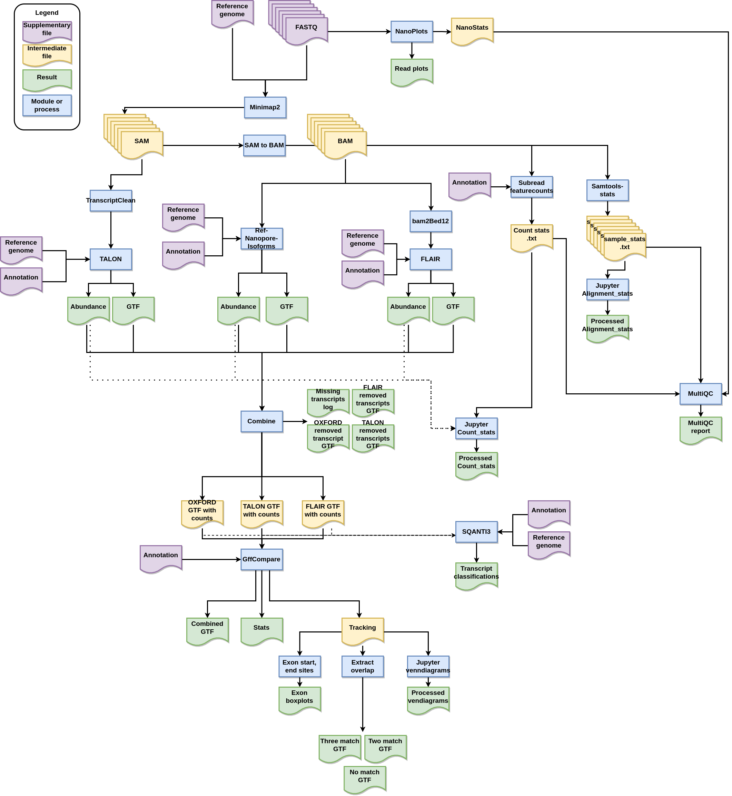

# RNA-seq Pipeline Comparison and Analyses

A Snakemake workflow for running TALON, FLAIR, and pipeline-nanopore-ref-isoforms. Performs a comparative analyses of results using tools such as GFFcompare.

# <a name="Flowchart"><a/>Flowchart



# <a name="Dependencies"><a/>Dependencies

1. Snakemake 7.3.1 <br>
[A full snakemake instalation is recommended](https://snakemake.readthedocs.io/en/stable/getting_started/installation.html#full-installation)
2. Singularity 3.7.0

# <a name="Installation"><a/>Installation

Clone the repository to desired location.

# <a name="How to run"><a/>How to run

1. Set parameters in ```config.yaml```
2. run: ```snakemake -p --use-singularity --singularity-prefix "resources"  --singularity-args "--bind *" --use-conda -j ** all --configfile "config/config.yaml"```

Note * : You should provide your own directory for the --bind command so that the data is accesible from the singularity containers. <br>
Note ** : Specify number of available threads here.

# <a name="Snakemake report"><a/>Snakemake report

You can run ```snakemake --report report.html``` AFTER the workflow finished to create a report containing results.

# <a name="Notes"><a/>Notes

The GTF files located in the 03_combined and 05_matched_transcripts have a column called TPM. This is not the Actual TPM value but the raw number of counts. The atrribute is hijacked to pass counts to GFFCompare.

# <a name="Troubleshooting"><a/>Troubleshooting

### Transcriptclean
Transcriptclean requires the reference genome fasta file to only have one string per header.

### Conda environment fails to build
Try running the workflow with an older version of snakemake such as version 5.3.2.


# <a name="License"><a/>License

MIT, see LICENSE